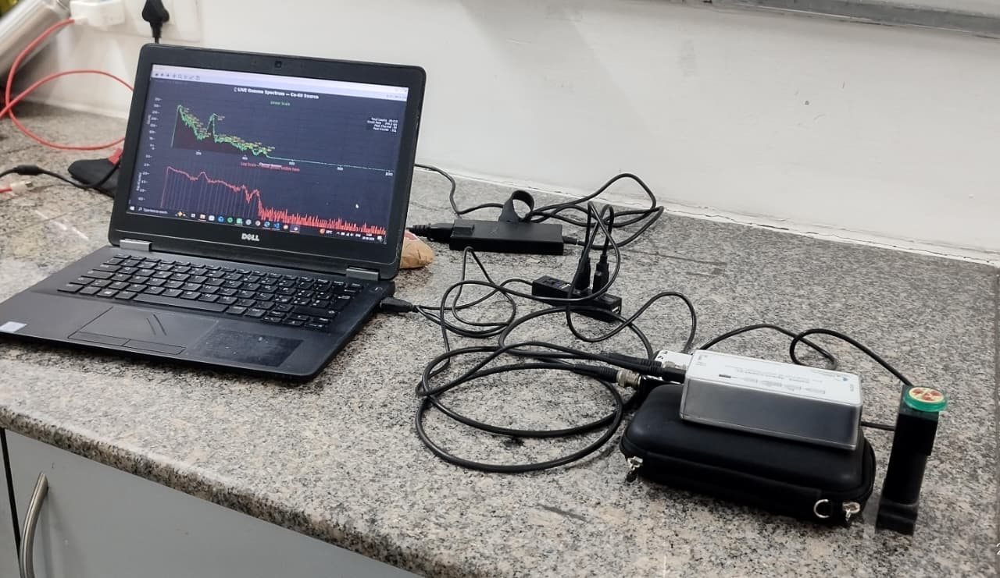
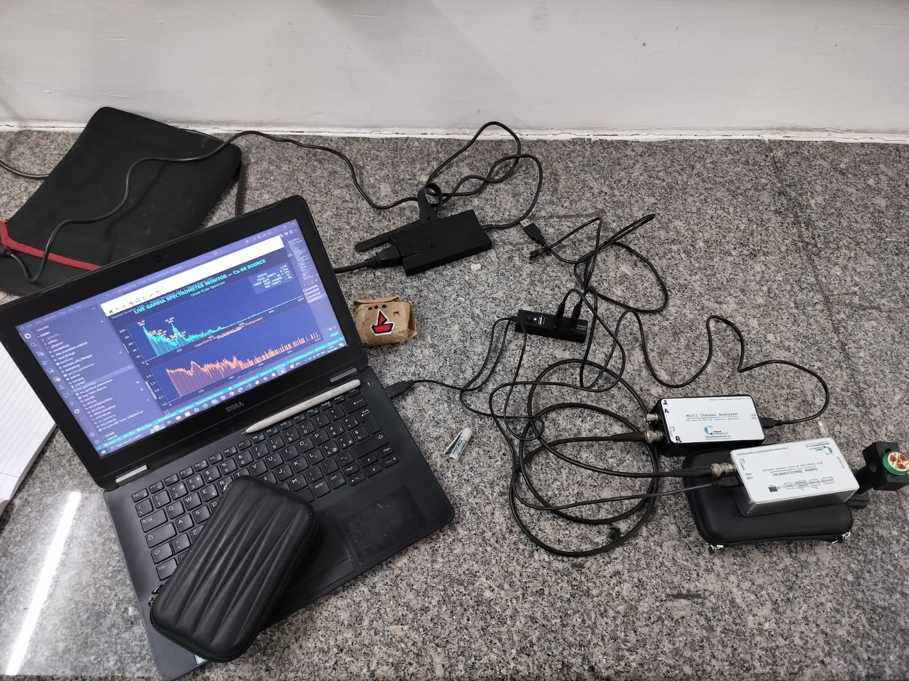
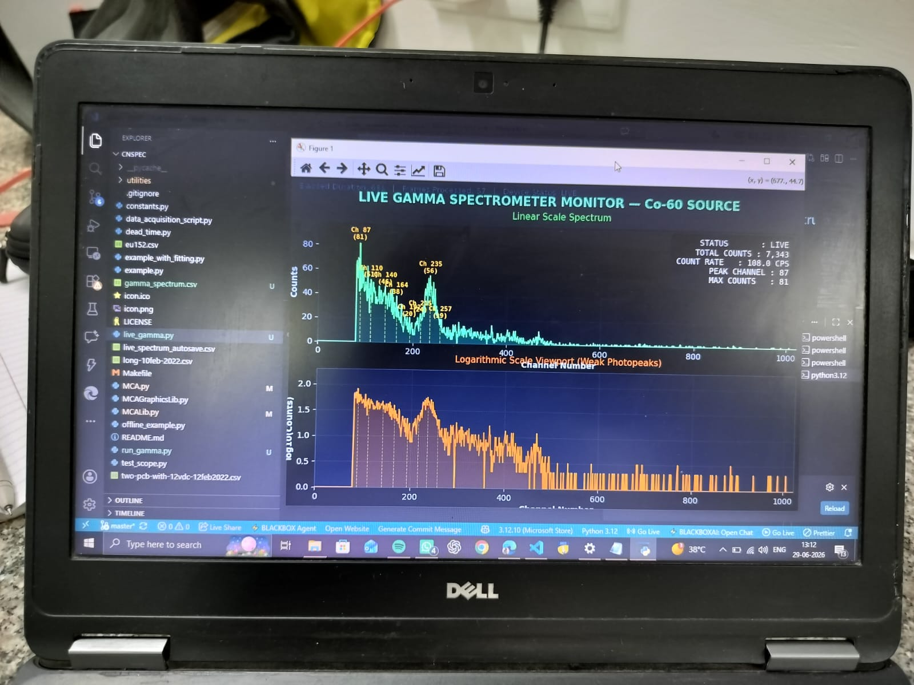
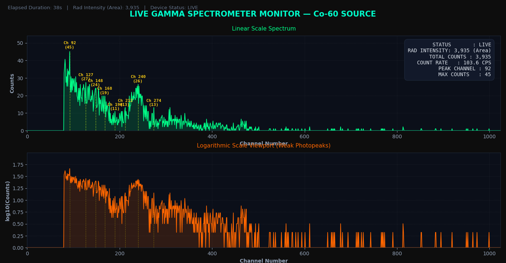

## Data acquisition and analysis tool compatible with the following instruments
+ [Alpha Spectrometer with 1K MCA](https://csparkresearch.in/alphaspec)
+ [Gamma Spectrometer with 1K MCA](https://csparkresearch.in/gammaspec)
+ [Multi-channel analyzers( 1K / 4K)](https://csparkresearch.in/mca1k)

<h1>Agentic AI</h1>

Building autonomous intelligence for the future.

 

<table align="center">
<tr>

<td align="center" width="25%">
  
<b>Autonomous Agents</b> 
Reasoning and execution systems
</td>

<td align="center" width="25%">
  
<b>AI Workflows</b> 
Scalable task automation
</td>

<td align="center" width="25%">
  
<b>Collaboration</b> 
Multi-agent communication
</td>

<td align="center" width="25%">
  
<b>Deployment</b> 
Production-ready intelligence
</td>

</tr>
</table>

  

<h2>Agentic AI Core</h2>

Designing systems that think, plan, collaborate, and evolve.

  

<table align="center">
<tr>

<td align="left" width="50%">

### Research Engine  
Building next-generation reasoning models.

### Agent Orchestration  
Managing intelligent workflow execution.

### Adaptive Systems  
Continuous learning and optimization.

</td>

<td align="center" width="50%">

</td>

</tr>
</table>

---

**Research • Build • Deploy • Evolve**

*Engineering autonomous intelligence.*

## Installing on Ubuntu
+ sudo apt-get install python3 python3-pyqt5 python3-pyqtgraph python3-serial numpy scipy
+ python3 MCA.py

## Installation packages

Downloads are available for Ubuntu and Windows on the [website](https://csparkresearch.in/cnspec)

